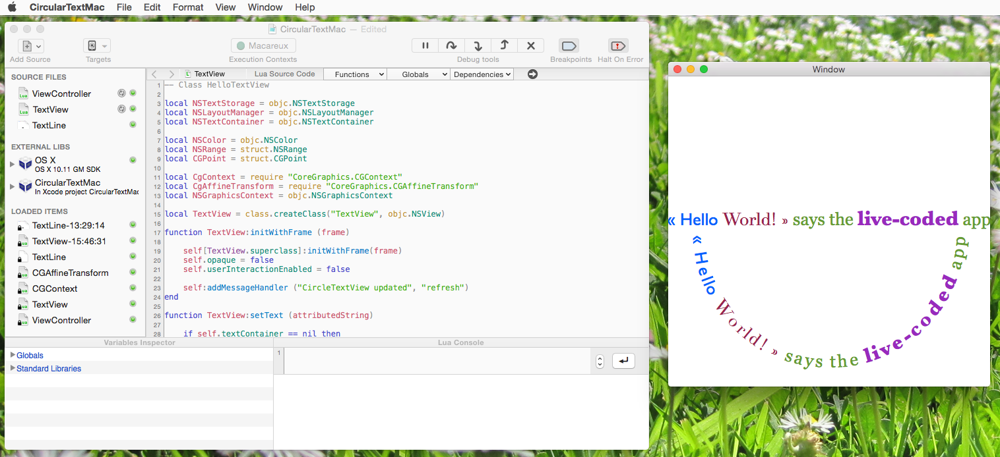

# Circular Text Mac

CircularTextMac is a very simple example of a Mac OS application developed in Lua with CodeFlow. 

It draws a rich-text string on a circular path in a view using TextKit. You can resize the application's window and see the circular being updated in real time for matching the new window size.

CircularTextMac is fully compliant with live-code and live-resource update, and you are encouraged to play with the code and see the immediate result in the app window.

Interesting aspects of this sample app include:

- This app uses a a standard Xcode storyboard-base Mac template, that has almost been left untouched, apart from the creation of a Lua Context and the loading of the `ViewController` Lua module asynchronously in the application delegate. 
- The ViewController Objective-C instance is created from the storyboard very early during the application launch, when the corresponding Lua class extension is not loaded yet. Therefore, to initialize its Lua aspects, a ViewController simply observes the `kCIMLuaModuleLoadedNotification`an calls `promoteAsLuaObject` when it receives the notification for the right Lua module.
- In Lua, the View Controller creates a `TextView` and uses auto-layout to configure the position and size of this view. You can change the layout constraints in real-time and see the result.
- The text-on-a-circle drawing takes place in  method `TextView:drawRect()`, where every individual glyph is translated and rotated to its final position. You can use it as a basis for placing the text on a different curve: this is a geometry-intensive task but the direct feedback in the target application helps a lot during the experimentations! :)

## Configuration required

A Mac running OS X 10.10 or later, with Celedev CodeFlow 0.9.19 or later.  
You can download CodeFlow from <https://www.celedev.com/en/support/#downloads> (registration required).

## How to use this code sample

1. Open the CodeFlow project for this sample application: `CircularTextMac.lapp`.  
  This will automatically update the associated Xcode project, so that paths and other build settings are correctly set for your environment.

2. Open the associated Xcode project. You can do this in CodeFlow with the menu command `Program -> Open Xcode Project`.

3. Run the application on your local Mac.

4. In CodeFlow, select the application in the `Target` popup menu in the project window toolbar. The app stops on a breakpoint at the first line of the Lua program.

5. Click on the `Continue` button in the toolbar (or use the CodeFlow debugger for stepping in the program) 

6. Enjoy the power of live coding with CodeFlow

## License

This application is provided under the MIT License (MIT)

Copyright (c) 2015 Celedev.

Permission is hereby granted, free of charge, to any person obtaining a copy
of this software and associated documentation files (the "Software"), to deal
in the Software without restriction, including without limitation the rights
to use, copy, modify, merge, publish, distribute, sublicense, and/or sell
copies of the Software, and to permit persons to whom the Software is
furnished to do so, subject to the following conditions:

The above copyright notice and this permission notice shall be included in
all copies or substantial portions of the Software.

THE SOFTWARE IS PROVIDED "AS IS", WITHOUT WARRANTY OF ANY KIND, EXPRESS OR
IMPLIED, INCLUDING BUT NOT LIMITED TO THE WARRANTIES OF MERCHANTABILITY,
FITNESS FOR A PARTICULAR PURPOSE AND NONINFRINGEMENT. IN NO EVENT SHALL THE
AUTHORS OR COPYRIGHT HOLDERS BE LIABLE FOR ANY CLAIM, DAMAGES OR OTHER
LIABILITY, WHETHER IN AN ACTION OF CONTRACT, TORT OR OTHERWISE, ARISING FROM,
OUT OF OR IN CONNECTION WITH THE SOFTWARE OR THE USE OR OTHER DEALINGS IN
THE SOFTWARE.
